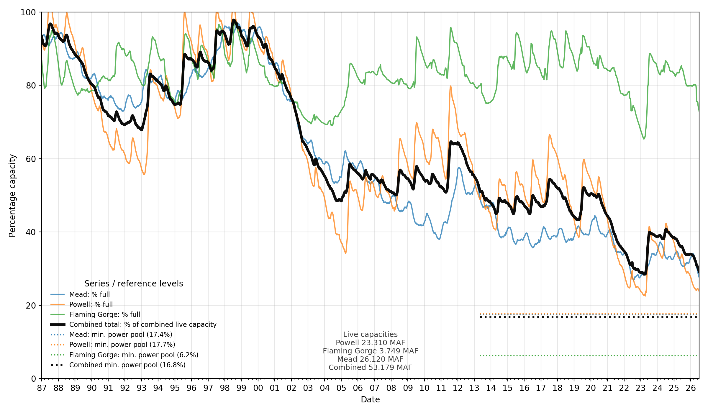

# Mead, Poweel, Flaming Gorge Reservoir Capacity

This repository plots a live capacity view of the Lake Mead, Lake Powell, and Flaming Gorge reservoir system. The script downloads current Bureau of Reclamation Hydrodata storage records, converts each reservoir to percent of live capacity above dead pool, and overlays minimum power generation reference levels.

The black curve shows the combined Mead/Powell/Flaming Gorge system as a percentage of combined live capacity. The colored curves show each reservoir individually.



## Usage

Install the Python dependencies:

```bash
python -m pip install pandas matplotlib
```

Generate the default plot:

```bash
python plot_MeadSystem_capacity.py
```

Plot a specific range:

```bash
python plot_MeadSystem_capacity.py --start-year 2021 --end-year 2026
```

Plot the last N years ending at a selected year:

```bash
python plot_MeadSystem_capacity.py --years 30 --end-year 2026 --output storage.png
```

## Output

By default, the script writes:

```text
reservoir_live_storage_percent_unwrapped.png
```

The dotted horizontal reference lines indicate the approximate live-storage percentage at minimum power pool for each reservoir and for the combined system.

## Data Source

Reservoir storage time series are downloaded from the Bureau of Reclamation Upper Colorado Basin Hydrodata reservoir dashboards.
